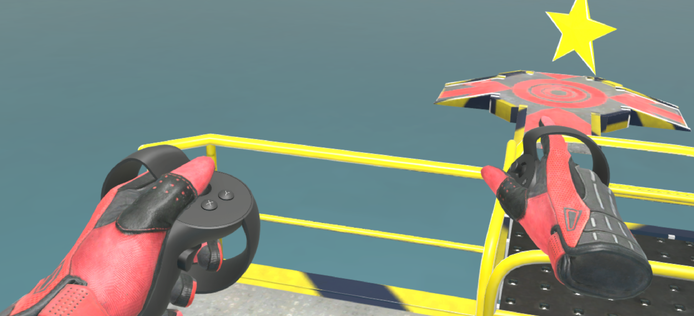
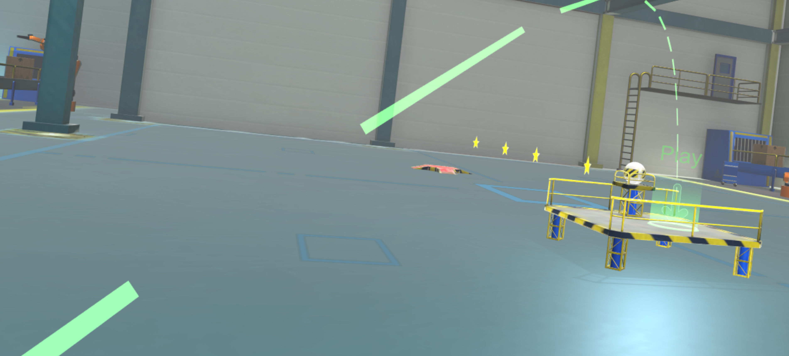

# Rube Goldberg
### Davide Zordan

This project implements a game targeting Oculus Rift and touch controllers using the SteamVR Unity plugin.

The goal is to collect all the stars available in the environment with a single launch of the ball from the platform and then reach the goal target.
Some helpers objects are available to construct a path for completing the game including: 2 types of planks, a fan, a trampoline and teleportation platforms for the ball!

The user can navigate the environment using the Oculus touch controllers and teleportation using the left hand controller thumbstick.
The object selection menu can be activated with the right thumbstick.
Trigger controls permit to interact and interact with objects using the trigger buttons.

Have fun!

## Getting Started

# Build and Test
It's possible to test the project using Unity. A build targeting SteamVR and Oculus Rift is available in the "Build.zip" archive.

# Using Unity
Scenes required (the order should be respected):

- RubeGoldberg\Assets\Scenes\Level 1.unity
- RubeGoldberg\Assets\Scenes\Level 2.unity
- RubeGoldberg\Assets\Scenes\Level 3.unity
- RubeGoldberg\Assets\Scenes\Level 4.unity

# Steps:
- Unzip the zip file
- Launch Unity (the project is targeting Unity 2017.4.15f1)
- Open the project located under the folder “RubeGoldberg"
- Open the scene "Level 1" to explore the hierarchy
- VR mode has been set on the Desktop build platform in the Build settings
- Launch Unity player to experience the game in the headset

# Versions Used
- [Unity LTS Release 2017.4.15](https://unity3d.com/unity/qa/lts-releases?version=2017.4)
- [SteamVR Unity plugin v2.2.0](https://github.com/ValveSoftware/steamvr_unity_plugin/tree/master/Assets/SteamVR)
